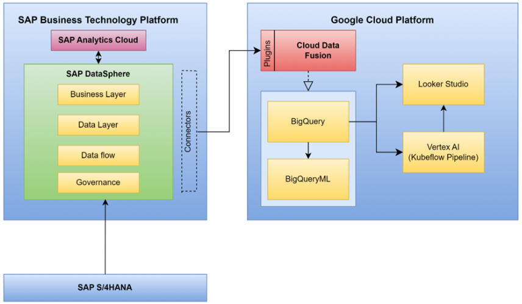

# Google Cloud–Enabled Analytics and Forecasting for MPD (End-to-End Data + ML + BI on GCP)

An end-to-end analytics and forecasting project for mobility products, built entirely on **Google Cloud Platform** using data extracted from internal SAP Datasphere sources.  
The workflow covers data ingestion, preparation, market segmentation (clustering), time-series forecasting, pipeline automation, and stakeholder dashboards—delivered as a public presentation.

**Presentation:** [Market Prediction & Analytics (PDF)](https://github.com/ranjith-24-prog/gcp_market_prediction/blob/main/gcp_market_prediction.pptx.pdf)  
**Portfolio write-up:** [GCP Market Prediction & Analysis](https://ranjith-mahesh-en.carrd.co/#gcp)

## Why this project
Manufacturing and distribution planning requires reliable, explainable projections of demand, costs, and profit across different markets.

This project focuses on:
- Turning enterprise data into decision-ready insights (historical + forecast).
- Segmenting markets to support targeted planning and regional strategy.
- Building a scalable, cloud-native blueprint that connects data engineering, ML, and BI.

## Business questions answered
- How do sales volume, revenue, material cost, and profit evolve over time by country and product?
- Which markets can be grouped into meaningful segments for planning and logistics?
- Which product categories provide strong revenue *and* sustainable profit margins?
- What do the next 24 months (2025–2026) look like for sales, cost, and profit by market?

## End-to-end workflow (GCP)
### 1) Data acquisition & ingestion
- Extracted historical data from SAP Datasphere (customers, orders, products, materials, profits) using Cloud Data Fusion pipelines.
- Integrated external currency exchange data to harmonize monetary values across markets.

### 2) Data preparation in BigQuery
- Uploaded and transformed CSVs in Cloud Storage + BigQuery.
- Standardized schemas, cleaned inconsistent names/types, and produced analysis-ready tables.

### 3) Market segmentation (clustering)
- Segmented customer markets using **K-means clustering** with BigQuery ML.
- Visualized cluster distributions and customer coverage in dashboards for decision makers.

### 4) Product category selection
- Analyzed product categories across 2011–2023 to identify high-value categories (revenue + profit).
- Focused downstream forecasting and planning on the most impactful product lines.

### 5) Forecasting (sales, materials, profit)
- Built time-series forecasting (Exponential Smoothing) using Python notebooks integrated with BigQuery data and BigQuery ML.
- Generated 24-month forecasts per country and product (sales quantities, revenues, expenses, profits).
- Derived future material requirements using forecasted sales + bill-of-materials analysis.

### 6) Orchestration & MLOps
- Automated and orchestrated the pipeline using Kubeflow pipelines and Vertex AI to support repeatable, scalable runs.

### 7) BI dashboards & reporting
- Published interactive dashboards in Looker Studio to compare:
  - Historical vs forecast performance
  - Profit drivers by market/product
  - Market clusters for planning and segmentation

## Deliverables
- Public presentation documenting the full cloud architecture, analysis, ML approach, and dashboards:  
  [Market Prediction & Analytics (PDF)](https://github.com/ranjith-24-prog/gcp_market_prediction/blob/main/gcp_market_prediction.pptx.pdf)
- A reusable blueprint for manufacturing analytics: ingestion → modeling → forecasting → BI.

## Tech stack (Data Scientist + AI/ML Engineer on GCP)
- Google Cloud Storage (raw file staging)
- Cloud Data Fusion (ETL / data integration from enterprise systems)
- BigQuery (cloud data warehouse, SQL analytics)
- BigQuery ML (in-warehouse ML, including K-means clustering) [BigQuery ML clustering example/usage reference](https://bigquery-lab.dimensions.ai/tutorials/05-topic_clusters/) [web:93]
- Python notebooks (forecasting experiments; Exponential Smoothing)
- Kubeflow (pipeline orchestration)
- Vertex AI (managed ML platform for running and operationalizing pipelines)
- Looker Studio (interactive dashboards; connects to BigQuery for reporting) [Example BigQuery → Looker Studio workflow](https://docs.supermetrics.com/docs/how-to-visualize-bigquery-data-in-looker-studio) [web:94]

## Key takeaways
- Cloud-native integration of ETL + in-warehouse analytics + ML forecasting enables scalable planning workflows.
- Market clustering improves regional targeting and planning discussions.
- Forecasts highlighted shifting sales/profit dynamics that can inform procurement, pricing, and supply-chain decisions.

## Notes / limitations
- This repository contains the presentation (implementation executed in Google Cloud).
- Results depend on the underlying enterprise dataset and business assumptions (e.g., exchange rates, aggregation logic).
